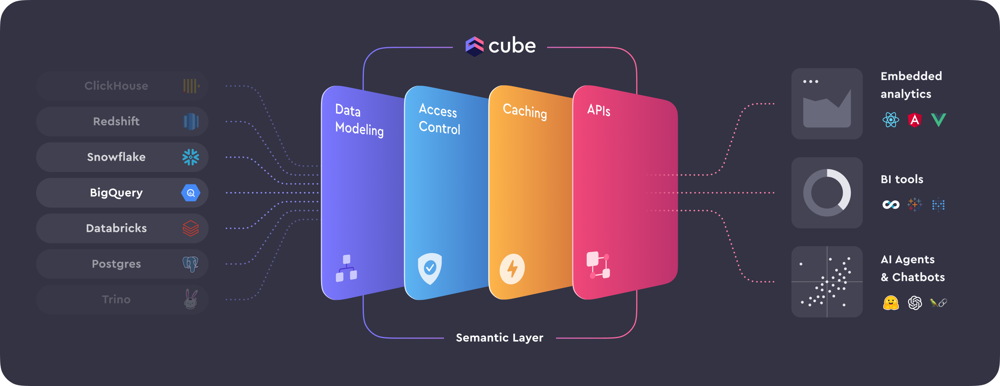

# Cube.dev

## What is it?

Cube is the **semantic layer** for building data applications. It helps data engineers and application developers access data from modern data stores, organize it into consistent definitions, and deliver it to every application.

## Main Value Proposition

The main value proposition of Cube lies in its ability to simplify the process of exposing databases through a unified API. 

Whether you're working with OLTP databases like PostgreSQL or OLAP systems such as ClickHouse, Cube acts as a bridge that allows you to seamlessly connect your data to various functions. 

By leveraging Cube, you can efficiently expose your database to different applications, including business intelligence tools (such as Metabase or Looker) via a PostgreSQL-compatible interface, and web frontends (like React or Angular) through its API. 

This streamlined approach significantly enhances data accessibility and integration, making it easier to deliver insights and build interactive applications.

## Confusion

### What is `Semantic Layer` really is?

Q: Can someone explain this "semantic layer" business (cube.dev)? Is it just a signal registry that helps you keep track of and query your ETL pipeline outputs?

A: Basic idea is you want some way of defining metrics. So something like `revenue = sum(sales) - sum(discount)` or `retention = whatever` which need to be generated via SQL at query time vs built in to a table. Then you can have higher confidence multiple access paths all have the same definitions for the metrics.

## Discussion on HN

> jrvarela56 on May 1, 2023 | parent | prev | next [–]
> 
> From what I read it’s a way to expose SQL via APIs 
Instead of starting from a general purpose web framework+orm you have your data/schema and can query it over http conveniently to build BI/dashboards.

> jayatid on May 1, 2023 | parent | prev | next [–]
> 
> It is kind of like an ORM. I find ORM's and semantic layers to be similar in many ways, except that semantic layers are meant for defining metrics too. These metrics describe aggregating data. Like summing order amounts to get revenue, or counting order_ids to get sales.

## Pros and Cons

### Pros
- **Unified API Access**: Cube provides a unified API to interact with different databases (OLTP and OLAP), simplifying the way data is accessed and queried. It can be integrated with BI tools (like Metabase, Looker) and web frontends (like React, Angular) using the same set of codes.
- **Semantic Layer**: Cube’s semantic layer allows you to define a consistent data model with measures, dimensions, and relationships.

### Cons
- **Additional Layer of Abstraction**: Cube introduces an additional layer between your databases and applications. Everyone in the organization need to understand and manage this abstraction layer, which can add complexity and a learning curve.
- **Potential Overhead**: The semantic layer and data caching can introduce overhead.
- **Versioning and Stability**: As Cube is continuously evolving, early versions might have stability issues or incomplete features.

## Verdict

Cube looks promising, especially with its semantic layer, which could simplify data modeling and enable unified querying for analytics. However, since it's still in version 0.36, I think it’s wise to wait until at least version 1 before fully implementing it, as that would likely bring more stability and feature completeness.
