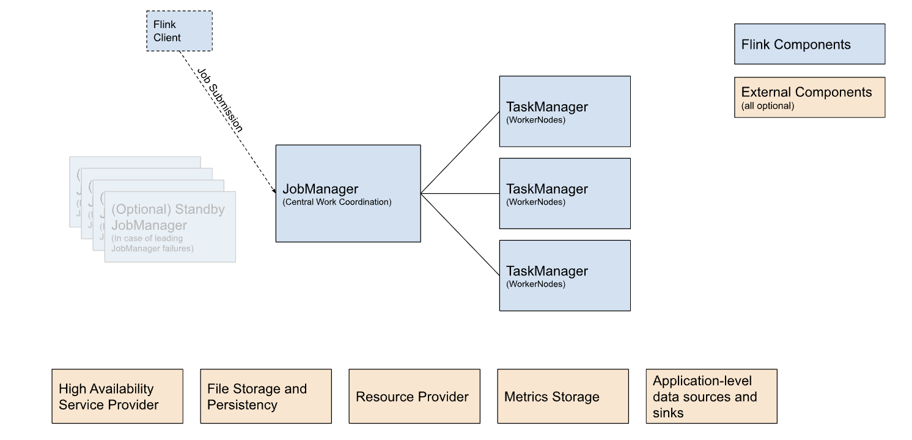

# NOTE

## Architectures

When deploying Flink, there are often multiple options available for each building block. We have listed them in the table below the figure.

### Flink Component
- **Flink Client**: batch or streaming applications written by user
- **JobManager**: the brain of Flink cluster, manage **TaskManager**
- **TaskManager**: services actually performing the work of a Flink job

### External Componnet
- **High Availability Service Provider**: Flink's JobManager can be run in high availability mode which allows Flink to recover from JobManager faults. Example: **Zookeeper** or **Kubernetes HA**
- **File Storage and Persistency**: For checkpointing (recovery mechanism for streaming jobs). Example: local, HDFS, S3
- **Resource Provider**: the one that gives machine and storage to Flink. Example: **Kubernetes** or **YARN**
- **Metrics Storage**: expose metrics for monitoring and analysis purpose. Example: **JMX**, **Prometheus**, **InfluxDB**
- **Application-level data sources and sinks**: Apache Kafka, S3, Elasticsearch

Ref: https://nightlies.apache.org/flink/flink-docs-master/docs/deployment/overview/

## Flink Deployment Mode

There are 
- **Application Mode**: dedicated to run only the Flink Jobs which have been bundled with the images
  - Pros: resources isolation
  - Cons: cold start when spinning up cluster for each job
- **Session Mode**: long-running Flink Cluster to which you can then submit Jobs
  - Pros: same cluster reused by more than 1 job
  - Cons: idle cluster still cost you money

